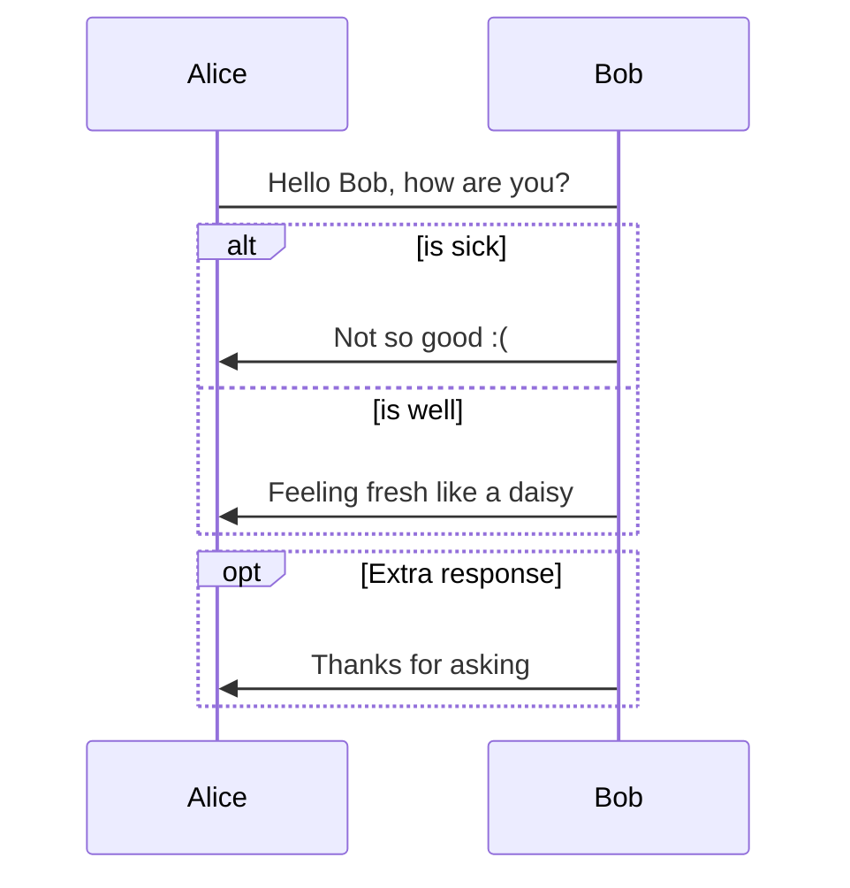
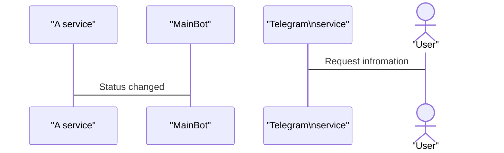

Test mermaid

```mermaid
  graph TD;
      A-->B;
      A-->C;
      B-->D;
      C-->D;
```

```mermaid
sequenceDiagram
    Alice->Bob: Hello Bob, how are you?
    alt is sick
        Bob->>Alice: Not so good :(
    else is well
        Bob->>Alice: Feeling fresh like a daisy
    end
    opt Extra response
        Bob->>Alice: Thanks for asking
    end
```

```mermaid
sequenceDiagram
participant srv as "A service"
participant mb as "MainBot" 
participant tg as "Telegram\nservice"
actor usr as "User"

usr -> tg : Request infromation
srv -> mb : Status changed
```

# TestMermaid