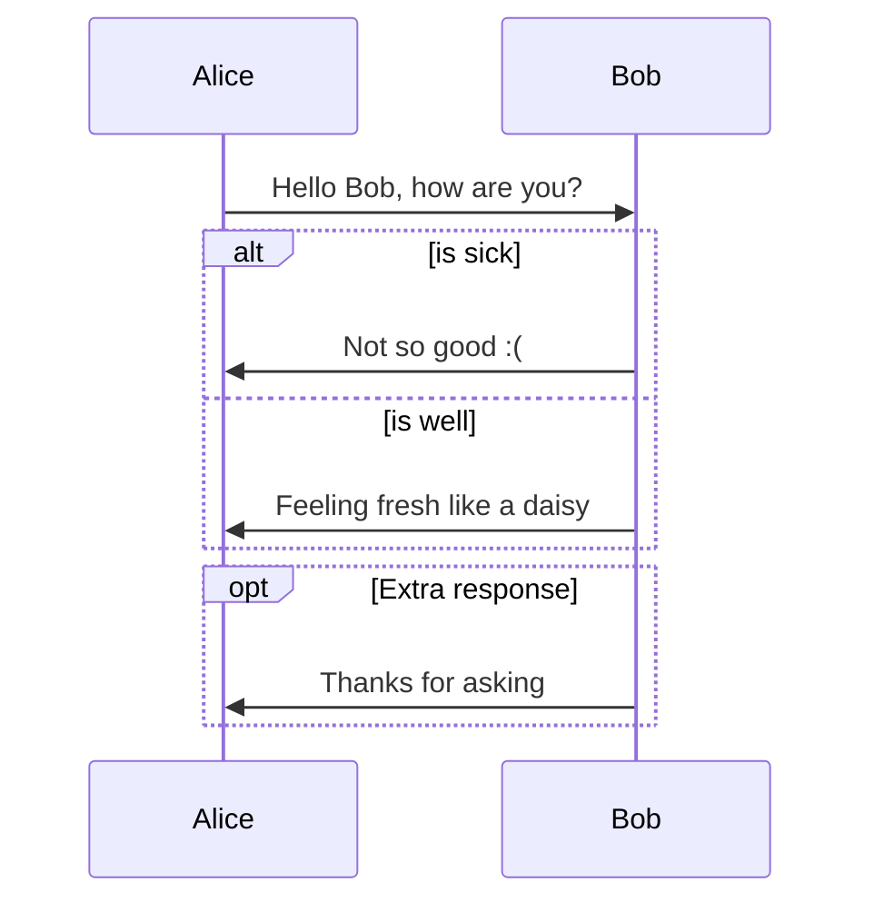

Test mermaid




```mermaid
sequenceDiagram
participant "A service" as srv
participant "MainBot" as mb
participant "Telegram\nservice" as tg
actor "User" as usr

usr -> tg : Request infromation
tg -> mb : Request information by user
mb -> mb : Identify type of infromation
mb -> mb : Find internal message id for this request
mb -> tg : Delete internal MessageId for this user
mb -> srv : Request infromation
mb <-- srv: Response information
mb -> mb : Generate telegram messages
mb -> tg : Send messages 
tg -> usr: Send new messages\n[because message id was deleted]
```


# TestMermaid